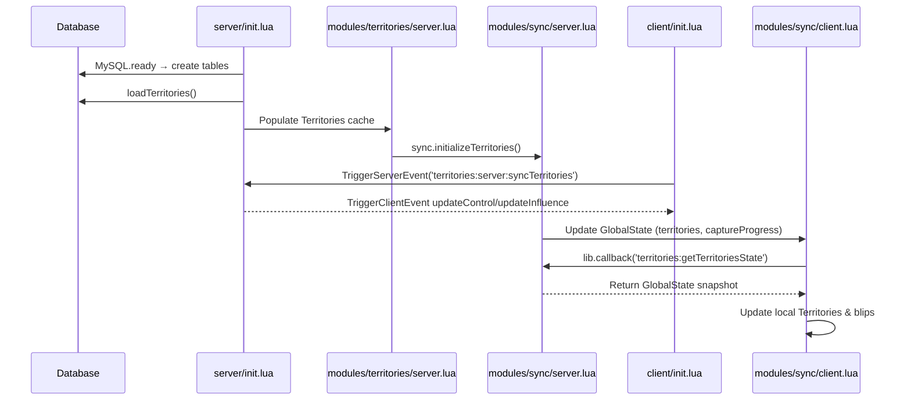

# Territory State Request Flow

This document traces how a client retrieves and stays synchronized with territory data after connecting to the server.

## High-level sequence

1. **Database bootstrapping** – When the resource starts, `server/init.lua` waits for the database, ensures required tables exist, and calls `loadTerritories()` to hydrate the in-memory `Territories` cache from MySQL. The loader normalizes each record (including zone centers) and inserts missing rows for predefined zones.
2. **Global state snapshot** – The territory management thread in `modules/territories/server.lua` invokes `sync.initializeTerritories()` on start. This copies the authoritative `Territories` table into shared `GlobalState` keys that ox_lib clients can observe.
3. **Client sync request** – As soon as a player loads, or when the client thread runs on resource start, `client/init.lua` triggers `territories:server:syncTerritories`. This is the explicit request path from the client endpoint.
4. **Server response** – The server listener in `server/init.lua` iterates over every loaded territory and sends control and influence updates back to the requesting client with targeted `TriggerClientEvent` calls.
5. **Ongoing updates** – The sync helpers in `modules/sync/server.lua` keep `GlobalState` in sync whenever control or influence changes. Clients subscribe to the corresponding statebags and also expose ox_lib callbacks (`territories:getTerritoriesState`, `territories:getCaptureState`) so late joiners can pull a fresh snapshot.
6. **Client consumption** – `modules/sync/client.lua` reacts to the statebag mutations and callback responses, mutating local territory entries and updating blip colors while raising notifications for capture progress.

## Sequence diagram

## Key data touchpoints

- **Database** – `server/init.lua` both reads (`MySQL.query.await`) and persists (`MySQL.update`, `MySQL.insert`) territory records during load and periodic saves.
- **GlobalState** – `modules/sync/server.lua` writes to `GlobalState.territories`, `GlobalState.captureProgress`, and `GlobalState.playersInZones`, while the client module attaches statebag change handlers for each key.
- **ox_lib callbacks** – Clients invoke `lib.callback('territories:getTerritoriesState')` and `lib.callback('territories:getCaptureState')` to bootstrap, with the server handlers returning the current `GlobalState` payloads.

This flow ensures every client receives a complete snapshot after the initial request and continues to receive incremental updates with minimal network overhead.
